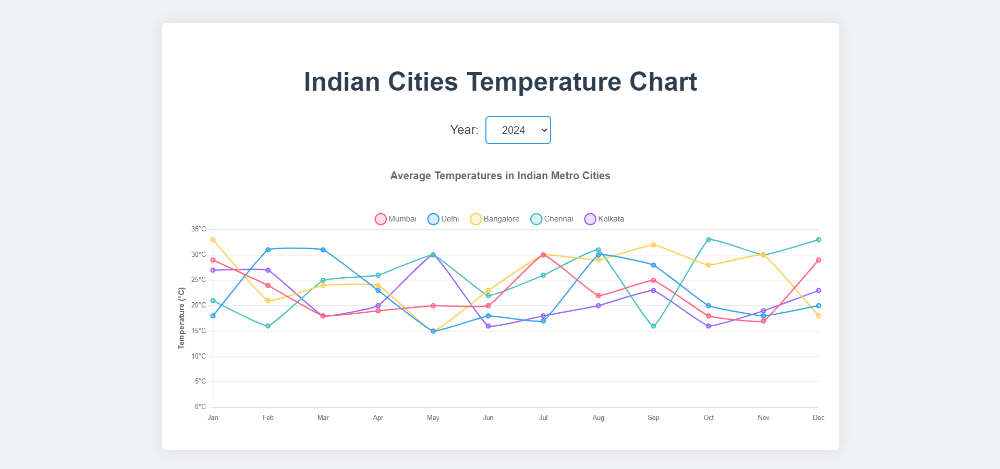

# Temperature Chart

## Library used 
Chart.js

### `git clone https://github.com/the-jatin-singh/temperature-chart.git`

### `npm i`

and thats pretty much it!

## Deployment

[deployed-app](https://unrivaled-sawine-279946.netlify.app/)
